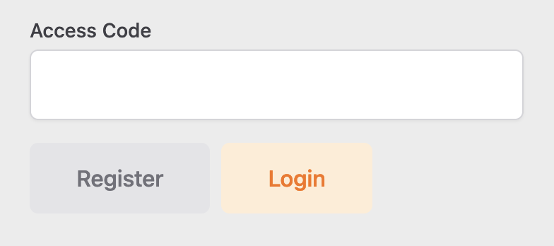

# Getting started with PalletPals

This getting started guide outlines the most important features for normal users and admins. For more detailed and technical description, please see our
[README](README.md) file. This deployed version automatically
creates a demo environment that contains four products, two warehouses, and one service provider. The four demo products share
exactly the same attributes as the four products from the requirements presentation. Same goes for the demo service provider
that shares the same price plan as the one provided via moodle. If this is not the case, please make sure
that the demo profile is selected in the [configuration](src/main/resources/application.yml) file.  
Therefore, you can register and start shopping right away!  
Please be aware that at least one warehouse, one service provider, and one product needs to exist, in order the system can be used.

For more detailed information on functionalities the following two section will go through the most important use cases for
users and admins.

## Getting started as user

After a user has registered oneself, without using the access key, or using a wrong access key the profile is saved with
user rights.

### Products

A user can see all products after he or she pressed on the products tab in the top menu. Product images are shown with their titles
and prices. If a user clicks on one product, he or she is redirected to a detailed page, where all images and details are displayed.
The demanded quantity can then be entered and the product will be added to the shopping cart.

### Shopping Cart

After users have added all products to their shopping cart, they see a preview of their shopping cart when the shopping cart icon is pressed
in the top menu. When then clicked onto "Go to cart" the user will see a detailed overview of his shopping cart including
already calculated shipping costs. Within the cart overview users are still able to adjust quantities of selected products or
they can even delete certain products.

### Order

Once a user confirms his order with pressing "Order" in the shopping cart overview, an order is created and saved. The shopping cart
is emptied simultaneously, that users are able to start with a new shopping experience. Past orders are visible in the "Profile" section, and their
details can be accessed if clicked on it. In the top right section there is a button "Add to Cart", that will
add the same products to the shopping cart. This function is specially made for users who regularly order the same
products. Accordingly, their reoccurring task can be shortened.

### Profile

In the profile section, users can see their past orders, update their personal data, and change their password.

## Getting started as admin

All the mentioned user functions can equally be accessed as an admin. Consequently, this section will only focus on the use cases relevant for admins. This demo version
has already an active admin account. The login credentials are as followed:

e-mail: **user@user.com**  
password: **password**

To register as an administrator an access key is needed. The key is: **testKey69**  
The access code should be entered on the registration page

### Admin dashboard

In order to manage all related content in the online shop, admins have access to a dedicated dashboard that can be found on top in the
menu bar. This is the starting point for all admin-related functions.

### Warehouses

The admin has the possibility to create, update, and delete warehouses and their addresses. When the system calculates the shipping
costs, it will calculate the distance from all warehouses to the address of the client, in regard to find the nearest
warehouse.

### Products

Similarly to warehouses, an admin can create, update, and delete products. Products can be equipped with images and descriptions in different
languages.

### Service Providers

The same priciple follows for service providers, that can be created, updated, and deleted. One functionality that
needs further explanation, is the upload of a price plan form a service provider. When existing service providers issue new
price plans, or a new service provider is registered to PalletPals, their price plan can be uploaded as a csv file. Please find our
[CSV](documents/priceplan/AlternativePricePlan.csv) file with an alternative price plan, and feel free to create a second service provider. Our system will always
choose the cheaper service provider when assigning orders.
