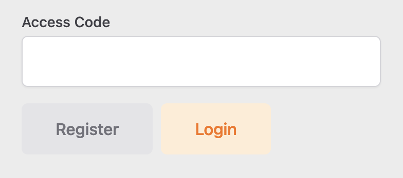
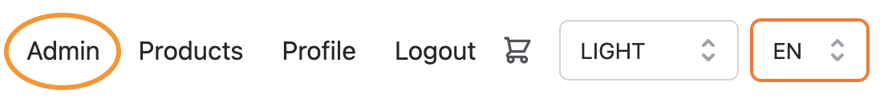

#Getting started with PalletPals

This getting started guide outlines the most important features for normal users and admins. This deployed version automatically 
creates a demo environment that contains four products, two warehouses, and one service provider. The four demo products share 
exactly the same attributes as the four products from the requirements presentation. Same goes for the demo service provider
that shares the same price plan as the one provided via moodle. Therefore, you can register and start shopping right away!

For more detailed information on functionalities the following two section will go through the most important functionalites for
users and admins.

##Getting started as user
After a user has registered themselves, without using the access key, or using a wrong access key the profile is saved with
user rights. 
###Products
User can see all products after they pressed on the products tab in the top menu. Product images are shown with their title 
and price. If a user clicks on one product, he or she is redirected to a detailed page, where all images and details are displayed. 
The demanded quantity can then be entered and the product will be added to the shopping cart.
###Shopping Cart
After users have added all products to their shopping cart, they see a preview of their shopping cart when the shopping cart icon is pressed 
in the top menu. When then clicked onto "Go to cart" the user will see a detailed overview of his shopping cart including 
already calculated shipping costs. Within the cart overview users are still able to adjust quantities of selected products or
they can even delete certain products. 
###Order
Once a user confirms his order with pressing "Order" in the shopping cart overview, an order is created and saved. The shopping cart
is emptied simultaneously, that users are able to start with a new shopping experience. Past orders are visible in the "Profile" section, and their 
details can be accessed if clicked on it. In the top right section there is a button "Add to Cart", that will
add the same products to the shopping cart. This function is specially made for users who regularly order the same 
products. Accordingly, their reoccurring task can be shortened.
###Profile

##Getting started as admin
All the mentioned user function can equally be accessed as an admin. Consequently, this section will only focus on the uses cases
only relevant to admins. 

To register as an administrator an access key is needed. The key is: testKey69

The access code should be entered on the registration page

###Admin dashboard
In order to manage all related content in the online shop, admins have access to a dedicated dashboard that can be found on top in the 
menu bar.

###Warehouses
The admin has the possibility to create, update, and delete warehouses and their addresses. When the system calculates the shipping
costs, it will calculate the distance from all warehouses to the address of the client, in regard to find the nearest
warehouse.
###Products
Similarly to warehouses an admin can create, update, and delete products. Products can be equipped with images and descriptions in different 
languages. 
###Service Providers
The same priciple follows for service providers, that can be created, updated, and deleted. One functionality that 
needs further explanation, is the upload of a price plan form a service provider. When existing service providers issue new 
price plans, or a new service provider is registered to PalletPals, their price plan can be uploaded as a csv file. The system
will then automatically overwrite the old file, and it will be used to calculate the shipping costs. 

