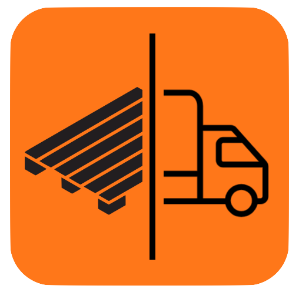
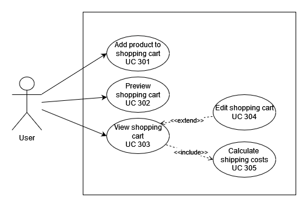
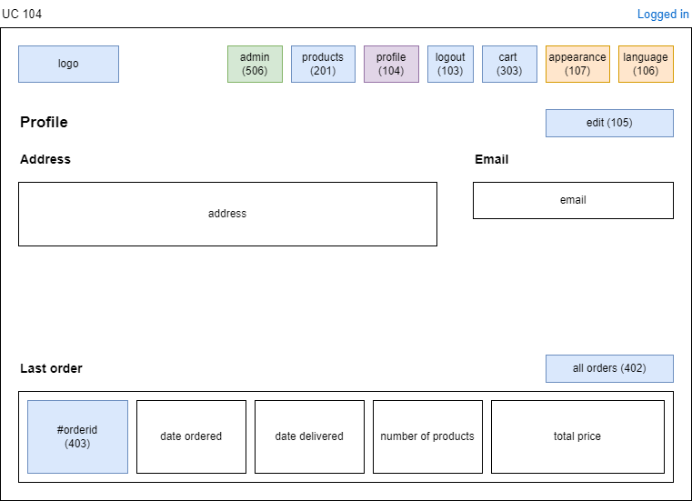
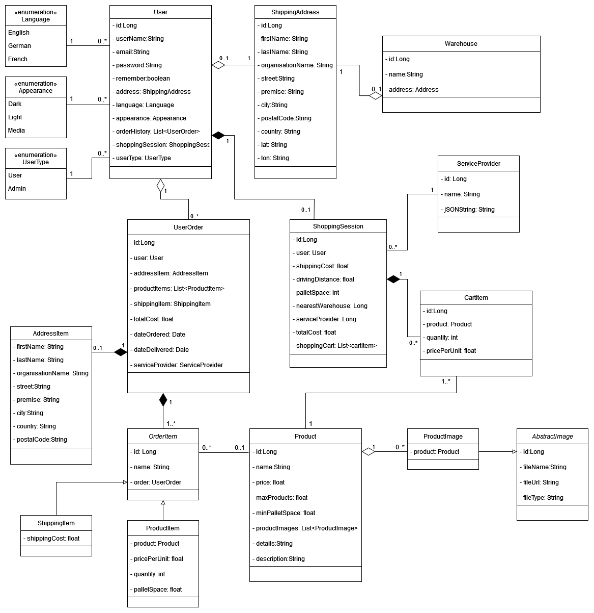
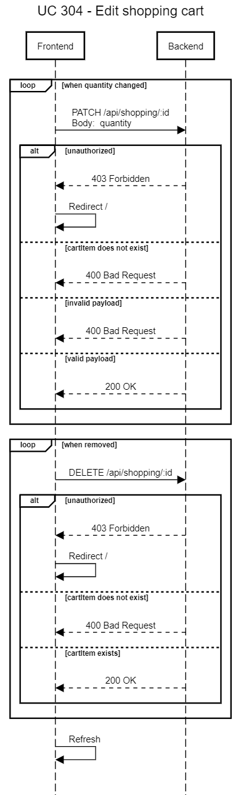

  

  <a href="#introduction">Introduction</a> | <a href="https://github.com/mahgoh/palletpals-client">Frontend Development</a>

# PalletPals Webapp

The PalletPals webapp was developed as a part of the IT-Project module of the Business Information Technology study programme at FHNW by Daniel Locher ([@dantheman625](https://github.com/dantheman625)) Tibor Haller ([@972C8](https://github.com/972C8)), and Marco Kaufmann ([@mahgoh](https://github.com/mahgoh)).

The project was developed in two repositories: [palletpals-webapp](https://github.com/972C8/palletpals-webapp) and [palletpals-client](https://github.com/mahgoh/palletpals-client). `palletpals-webapp` contains the main application and the final web application. The frontend was developed in the repository `palletpals-client` - more information can be found in the repository.
The api endpoints were designed with the help of Postman. The API design can be found at: https://documenter.getpostman.com/view/17679206/Uz5AseV9.

## Introduction

The content is structured based on the project milestones, more concretely the three main phases of "defining and documenting the requirements", "technical design", and "implementation".

#### Contents:

- [Requirements](#requirements)
  - [Use Case](#use-case)
  - [Non-Functional Requirements](#non-functional-requirements)
  - [Mockups](#mockups)
- [Design](#design)
  - [Class Diagram](#class-diagram)
  - [Database Design](#database-design)
  - [Sequence Diagram](#sequence-diagram)
  - [Endpoint Design](#endpoint-design)
- [Implementation](#implementation)
  - [Backend Technology](#backend-technology)
  - [Backend Implementation](#backend-implementation)
  - [Frontend Technology](#frontend-technology)
- [User Guide](#user-guide)
- [Project Management](#project-management)
  - [Roles](#roles)
  - [Milestones](#milestones)

## Requirements

### Use Case

In phase 1 requirements, the necessary use cases were created as a basis for the implementation. As an example serves the overview of the use cases relevant to the shopping cart, which is one of the key functionalities.

All use cases can be found in [`/documents/deliverables/PalletPals_Phase1_Requirements.pdf`](documents/deliverables/PalletPals_Phase1_Requirements.pdf).

### Mockups

For each use case, a mockup was created in phase 1. In phase 3, these mockups served as guidance for creating the visual appearance of the frontend. Furthermore, they helped to make sure that the defined requirements for the backend and the communication protocol were sufficient to achieve the desired user interface. Below, the mockup for the use case `104 - View user data` shows the general layout that the profile page shall have.

Mockups for all use cases can be found in [`documents/mockups`](./documents/mockups/).

## Design

### Class Diagram

The Class Diagram shall give the reader of this document an overall perspective about the class structure of our application. Mostly, this diagram aims to be self-explanatory, nevertheless we like to point out a few things.

As our goal is to exceed the basic requirements, we plan to develop a more holistic online shop experience. One key issue was to ensure that orders reflect a snapshot of the relevant data, which is important when for example the user changes his address after an order was finalized, or that for example historic order data are preserved correctly. Wehave roughly split our classes into three overall data groups:

- Static Data

  This group includes all regular data classes, such as classes with product and user related data. A user should be able to change his personal data, as well as product data can change over time.

- Session Data

  We pursue to offer a real online shop feeling. With this in mind, we introduced session data to preserve a user’s shopping basket over a certain period. Even if the website will be left, the shopping cart of a user is still saved in our database. Therefore, if this user revisits our website, he or she can flawlessly continue his or her purchase. Session data includes the classes ShoppingSession and CartItem. Once a user submits his order, the session data is used to create an order with the correct information, such as quantities or shipping address.

- Processed Data

  After a user has confirmed the order, the data gathered in his or hers shopping session will be changed to processed data, using the order class. According to the user’s shopping session new objects of the classes Order, AddressItem, ShippingItem, and ProductItem will be created and referenced by the new order object. AddressItem is part of Order as it is only relevant in that context and only used to store address attributes as part of the class. The logic behind this process is, that the user shall have an history of his or her orders. These objects are important to ensure the data integrity as simply working with references incurs the risk of faulty order when some data is updated at a later point. One example that must be handled is that the user updates his shipping address after finalizing an order. Furthermore, the ShoppingSession object with its related CartItems get deleted as soon as the order has been saved to the database, meaning that the user’s shopping cart is emptied.

### Database Design

### Sequence Diagram

Sequence diagrams were created to provide information about the communication between the frontend and the backend. Interaction happens via HTTP requests made by the frontend. The backend only responds to request and never makes a request to the frontend by itself (Client-Server Architecture).

For each use case, a sequence diagram was created in phase 2 of the project. These diagrams served as guidance during phase 3 for both the frontend and the backend. For example, in the use case of `304 - Edit shopping cart`, communication happens as follows:

Sequence diagrams for all other use cases can be found in the directory [`documents/sequence-diagrams`](./documents/sequence-diagrams/).

### Endpoint Design

The Postman API Platform was used for the endpoint design and during the implementation of the backend. Using Postman allowed us to create the API collaboratively and efficiently thanks to a synchronized workflow. Furthermore, Postman also allowed us to create the API documentation through an out-of-the-box, user-friendly, web-view of the API.

Please check out our endpoint design at https://documenter.getpostman.com/view/17679206/Uz5AseV9 for a user-friendly web-view of the API.

In addition, the overview of the available api requests is found in the [documents](https://github.com/972C8/palletpals-webapp/tree/main/documents) folder to ensure availability of the resource in the future.

## Implementation

### Backend Technology

The backend was initially based on a fork of https://github.com/DigiPR/acrm-webapp. The following excerpt is copied from acrm-webapp and explains the main project dependencies:

#### Dependencies according to the ACRM fork:

This Web application is relying on [Spring Boot](https://projects.spring.io/spring-boot) and the following dependencies:

- [Spring Boot](https://projects.spring.io/spring-boot)
- [Spring Web](https://docs.spring.io/spring/docs/current/spring-framework-reference/web.html)
- [Spring Data](https://projects.spring.io/spring-data)
- [Java Persistence API (JPA)](http://www.oracle.com/technetwork/java/javaee/tech/persistence-jsp-140049.html)
- [H2 Database Engine](https://www.h2database.com)
- [PostgreSQL](https://www.postgresql.org)

To bootstrap the application, the [Spring Initializr](https://start.spring.io/) has been used.

### Backend Implementation

The following documentation shall highlight certain key functionalities implemented in the backend.

#### Support of Product Images (using Inheritance)

To improve the user's experience, product images can be created and added to products. One product can have zero or multiple product images.

The class ProductImage extends AbstractImage, which holds the main attributes relevant to images (such as fileName, fileType and fileUrl). Using this approach, future extension of the webapp to support other image types is easily supported.

##### Single table inheritance and discriminator

The image implementation uses single table inheritance and a discriminator column.
This effectively means that only a single table is created in the database (although there are more classes) and that the discriminator is used to determine which class the particular row belongs to.
More information is found at https://en.wikibooks.org/wiki/Java_Persistence/Inheritance#Single_Table_Inheritance

##### Storing of Images

Images are stored in the directory "/uploads" and a database entry is created for the ProductImage, which holds the relevant information (fileName, fileType, fileUrl). When a GET request is sent, the entry is retrieved from the database and the image is taken from the file system using this information.

In a real world, the service could be further improved by storing images directly in an external cloud storage instead of in the project directory.

#### ShoppingSession

The shopping session provides a user with a shopping cart that includes the individual products to be ordered and the calculated costs, such as shipping costs. It is preserved for users even if they log out.

The shopping session holds a shopping cart consisting of CartItems. CartItems represent the ordered Product, thus having a reference to the product with quantity specified by the user.

When users submit an order, the shopping session is used as the basis to create the order based on the ordered products and quantities.

#### UserOrder

Orders are central to the webapp and represent a snapshot of the user's order of products and quantities.

A UserOrder represents a finalized submitted order by a user that takes the shopping session to calculate (shipping) costs based on the ordered products and quantities, using ServiceProvider and Warehouse.

A UserOrder references other classes to represent a complete user order. When a user submits a new order, the current shopping session with references is translated into a snapshot, represented by a UserOrder, that includes all relevant classes, such as ProductItem, ShippingItem, and AddressItem. Users can view their orders using the provided order history, with all details.

##### OrderItem

An abstract class OrderItem is used to represent the data relevant for orders. Both ProductItem and ShippingItem extend the abstract class OrderItem. An abstract class is used to support further extension of the functionality to hold different data relevant for orders.
First off, one UserOrder can hold one or multiple ProductItems that each represent one ordered product together with the specified ordered quantitiy. Furthermore, one UserOrder references one ShippingItem, which holds the calculated shipping costs.

##### AddressItem

In addition to this reference, an order must also hold the current address of the user that the shipment is sent to. In order to ensure that the address is correct, it is not possible to use a simple reference, because if a user changed his address at a later point, the shipment would reference the new, possibly wrong address.
Therefore, the class AddressItem is used and referenced by UserOrder to represent a snapshot of the address that the shipment should be sent to.

#### Shipping cost calculation

### Frontend

The frontend was developed in a separate [repository](https://github.com/mahgoh/palletpals-client) using [React](https://reactjs.org) as a framework, [Tailwind CSS](https://tailwindcss.com) for styling, [Vite](https://vitejs.dev) for frontend tooling, and [Vitest](https://vitest.dev) as testing framework. Instructions on how to develop, build, and test the frontend can be found in the separate repository. During development, a reverse-proxy is required to simulate an environment with one domain to fully support the usage of authentication Cookies. As a result, a basic reverse-proxy **p3** was setup using [Go](https://go.dev) and is part of the frontend repository as well.

#### Main Dependencies

- **[React](https://reactjs.org)**: Framework
- **[React Router](https://reactrouter.com)**: Client-side routing
- **[Tailwind CSS](https://tailwindcss.com)**: Appearance
- **[Vite](https://vitejs.dev)**: Frontend tooling
- **[Vitest](https://vitest.dev)**: Test framework
- **[i18next](https://www.i18next.com)**: Internationalisation

The full list of all dependencies can be found by looking at the `package.json` file.

### Frontend Implementation

The application is built using React and React Router. This enables a component-based approach that allows a fast and great developer experience, and improves to extendability in comparison to static HTML files. Furthermore, the backend and frontend operate independently and are interchangebly.

- **React** makes interacting and manipulating DOM elements easy. _Hooks_ provide an easy way to manage state and events during the application lifecycle. _Contexts_ provide a simple way to share state across the application (e.g. authentication state).
- **React Router** enables client-side routing without hard page reloads, resulting in a better user experience.
- **Component-based approach** allows reusing components at different locations in the application.
- Browser **built-in APIs** like Fetch allow to easily make request to the backend.
- **i18next** enables a simple-to-curate translation service that is easily extendible.

#### Visual Appearance

The power of utility classes in CSS, especially, when working in a team is incredible. We use [Tailwind CSS](https://tailwindcss.com) to make use of this and ensure a great collaboration and maintainability in the future. This means that we did not write a single line of CSS but used utility classes instead. This promises to lead to a more consistent visual appearance and easier collaboration and maintenance. To learn more about this approach and it's benefits read the [article](https://adamwathan.me/css-utility-classes-and-separation-of-concerns/) by Adam Wathan the creator of Tailwind CSS.

Thanks to the component-based approach, the use of utility classes makes even more sense. Otherwise, there would be the chance that we'd had to rewrite the same elements over and over. If they have many utility classes, this can result in a loss of clarity. With the use of components, the readability is improved a lot and the utility classes describe precisely the appearance of the element.

Thanks to the Tailwind CSS JIT compiler and the frontend tooling of Vite, all used classes are generated just-in-time during development. Finally, when the project is built, a CSS bundle with only the used classes is created.

#### Bundling

During development, Vite performs Hot Module Replacement (HMR) and loads the individual modules directly, for a fast developer experience. Finally, when building for deployment, Vite (or rather Rollup) bundles the code into static assets. By default, this results in a single HTML file along with a JS bundle, a CSS bundle, and potential assets. The JS, CSS, and asset files are hashed to overcome Browser caching when something as changed. These static files are then served by the backend.

## User Guide

Give an overview of the webapp

## Project Management

### Roles

- Backend: Daniel Locher & Tibor Haller
- Frontend: Marco Kaufmann
- Conceptual: All

Note that some overlap between frontend and backend responsibilities existed.

### Milestones

- **Phase 1**: Define and document requirements
- **Phase 2**: Technical Design
- **Phase 3**: Implementation

#### License

- [Apache License, Version 2.0](blob/master/LICENSE)\*\*\*\*
